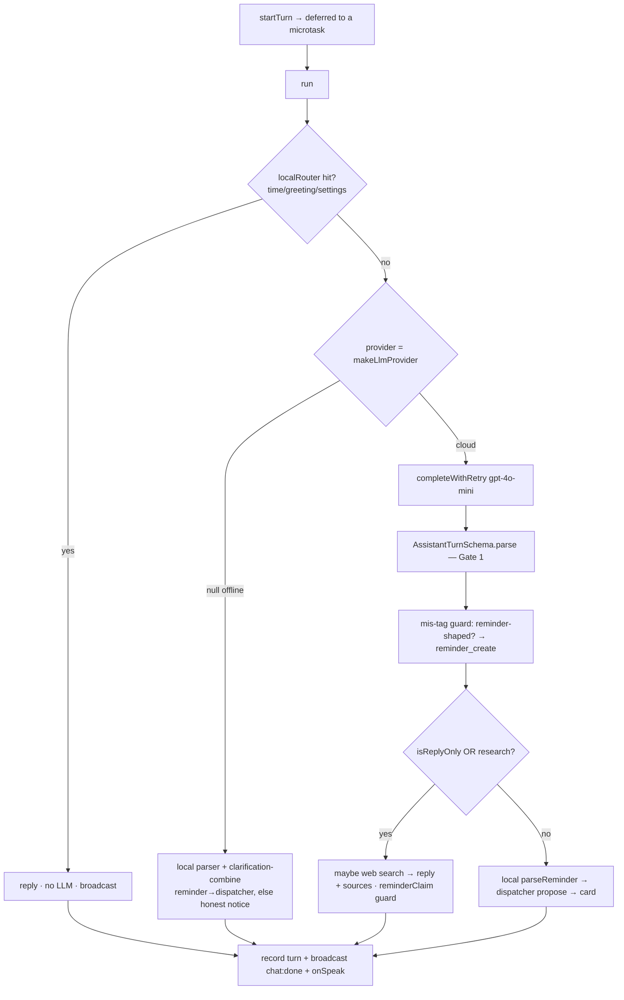
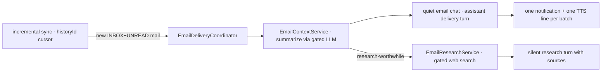

# AI Integrations

> **Home:** [docs/README.md](./README.md) · **Related:** [ARCHITECTURE](./ARCHITECTURE.md) · [WEB_SEARCH](./WEB_SEARCH.md) · [VOICE_PIPELINE](./VOICE_PIPELINE.md) · [REMINDER_SYSTEM](./REMINDER_SYSTEM.md)

Every AI capability sits behind a **pure `core/` seam** and is gated by the provider registry. Today's only cloud backend is OpenAI; the seams (`LlmProvider`, `SpeechProvider`, `TextToSpeechProvider`, `SearchProvider`, `TranscriptCleaner`) make additional/local backends drop-in.

## 1. The provider registry (gating)

`electron/providers/registry.ts` decides, from a settings snapshot (`ProviderConfig`), which concrete provider backs each seam. It returns the cloud provider **only** when enabled + keyed + consented, else a local provider or `null`.

| Factory | Cloud when… | Fallback |
| --- | --- | --- |
| `makeLlmProvider` | `ai_assist_enabled` + key + AI consent + `ai_provider='openai'` | `null` (engine degrades to local parser / offline notice) |
| `makeSpeechProvider` | `stt_provider='openai'` + key + STT consent | sherpa (always, via `withFallback`) |
| `makeTtsProvider` | `tts_provider='openai'` + key + TTS consent | Windows `speechSynthesis` |
| `makeSearchProvider` | `web_search_enabled` + AI enabled + key + AI consent | `null` |
| `makeTranscriptCleaner` | `stt_cleanup_enabled` + AI enabled + key + AI consent | `null` (raw transcript) |

Factories are **pure and re-run per operation** (live rebind), so toggling a setting takes effect without a restart. Web search is a **separate seam** from the LLM by design.

## 2. The ConversationEngine

`electron/conversation/conversation-engine.ts` is the per-turn brain. Two hard invariants:

1. **Exactly one `chat:done` per turn** — even on an unexpected throw (the renderer clears `busy` on `chat:done`; a path that exited silently would hang the composer forever).
2. **The LLM never actuates** — reply-only intents get the model's reply; action intents **drop** the model's proposed action and re-route the *original text* to the local `parseReminder`, so a reminder is byte-for-byte the local path.

### Per-turn flow



Key mechanics (all in `conversation-engine.ts`):
- **Deadlines**: 20s chat (`CHAT_TIMEOUT_MS`), 35s search (`SEARCH_DEADLINE_MS`); a per-turn `AbortController`; one backoff retry on 429/5xx.
- **Context**: `ContextBuilder` sends the system prompt + now/timezone + a bounded reminder summary (**titles + relative time only**, never ids/epochs — a prompt-injected model can't exfiltrate a row it was never shown) + an empty `memories` slot. History is a sliding window of `MAX_HISTORY = 12` turns; delivery turns (empty user text) project to assistant-only messages.
- **Mis-tag guard**: a turn that parses as a valid future-dated reminder is treated as `reminder_create` even if the model tagged it `research`/`question` (e.g. "remind me tomorrow to tell me NIT Hamirpur's contact" — the lookup must happen when it *fires*, not now).
- **Reliability guard**: if the user asked for a reminder and the model's reply *claims* one was set but none was created, the false claim is replaced with an honest failure notice. gpt-4o-mini disobeys the "never claim" instruction sometimes, so a prompt fix alone is not trusted.
- **Offline path**: no provider → local parser, with a **clarification-combine** that threads a pending under-specified reminder across turns so a multi-turn reminder completes offline; a parsed reminder still goes through the dispatcher (confirmable card + spoken prompt); genuine reasoning gets an honest "needs an online provider" notice.

## 3. The AssistantTurn contract (Structured Outputs)

`core/conversation/turn-schema.ts` defines a single strict JSON object used **both** as the OpenAI Structured-Outputs `json_schema` and as the Zod validator on the way back in:

```jsonc
{
  "intent": "chat|question|research|reminder_create|reminder_update|reminder_delete|memory_save|memory_query|settings|unknown",
  "reply": "1–3 sentence spoken-style answer",
  "action": null,                // always null — the LLM never actuates
  "confidence": 0.0-1.0,
  "needsClarification": bool,
  "needsWebSearch": bool,        // model asks the app to search
  "searchQuery": "string|null"
}
```

`.strict()` means an unknown key is a **rejection** (Gate 1). The intent taxonomy lives in `core/conversation/intent.ts`; `REPLY_ONLY_INTENTS = ['chat','question','unknown']`, and `research` is routed to the answer branch (and forces a search). Only `reminder_create` has an executor today; other action intents are classified but not executable (**Planned**).

## 4. The system prompt

`core/conversation/system-prompt.ts` — a static prompt (never contains user data). It frames Yogi as a **general helpful companion** (explicitly told never to refuse ordinary harmless requests, after gpt-4o-mini once refused to tell a joke), defines the closed intent set, tells the model to classify future-time lookups as `reminder_create` (not `research`), instructs it to set `needsWebSearch` for live facts, and **forbids claiming a reminder is already done** (the app creates it only after confirmation).

### 4.1 Rendering AI replies (Markdown)

The model returns Markdown (headings, `**bold**` lead-ins, numbered/bulleted lists, `` `code` ``, `[text](url)` links). The **normal assistant reply** is rendered by `src/components/Markdown.tsx` in the main chat (`MessageBubble`), the voice launcher (`LauncherApp`), and the reminder popup (`PopupApp`), so `**Features**` shows as bold **Features** — never literal asterisks. It builds **React elements only (never `dangerouslySetInnerHTML`)**, so untrusted model output can't inject markup, and is **tolerant of partial/malformed Markdown** (unclosed markers degrade to literal text). Links render their **anchor text only** (the URL is dropped): an `<a href>` would navigate the whole Electron window and a `javascript:` href would be an injection vector, so text-only is the safe choice. User bubbles and delivered emails/reminders stay plain pre-wrap text. See [FRONTEND §2](./FRONTEND.md).

## 5. OpenAI providers

| Provider | Model | File | Notes |
| --- | --- | --- | --- |
| **LLM** | `gpt-4o-mini` | `openai-llm-provider.ts` | Strict Structured Outputs, **non-streaming** by design (`chat:delta` reserved). |
| **STT** | `gpt-4o-transcribe` | `openai-speech-provider.ts` | Batch WAV POST; behind `withFallback(sherpa)`. |
| **TTS** | `gpt-4o-mini-tts` | `openai-tts-provider.ts` | Streamed to the audio window via MSE; blob fallback. |
| **Search** | `gpt-4o-mini-search-preview` | `openai-search-provider.ts` | Parses `url_citation` annotations into sources; own 30s timeout + abort signal. See [WEB_SEARCH](./WEB_SEARCH.md). |
| **Transcript cleaner** | `gpt-4o-mini` | `openai-transcript-cleaner.ts` | Post-STT dictation cleanup. |

The API key is read in main **at call time** (`apiKeyStore.get()`); it never crosses IPC. Requests go only to `api.openai.com`, allowlisted by the session filter only when a cloud feature is on.

## 6. Reminder-execution (AI-task reminders)

A fired reminder can **do** something, not just speak its title. `core/parsing/classify-execution.ts` locally classifies whether a reminder's title is an AI task (e.g. "remind me tomorrow to tell me NIT Hamirpur's contact"); if so, an `execution` spec is attached and the confirmation summary states the intent. At fire time, `electron/reminders/reminder-executor.ts`:

- Read-only tasks (web_search) **auto-execute** — the user already consented at creation.
- Any **write** capability (send email, create event) returns `needs_confirmation` (defensive future-proofing — no write capability is emitted yet).
- Bounded (35s deadline) and degrades honestly (offline/timeout → an honest message, never a hang or a thrown reminder).
- The **answer** (not the title) is spoken and delivered into the chat; the unconditional notification + history already fired first.

See [REMINDER_SYSTEM §execution](./REMINDER_SYSTEM.md).

## 7. Gmail AI (email intelligence)

Opt-in, built in 5 phases (all shipped; phases 1–2 live-verified, 3–5 verified by construction). Files: `electron/gmail/*`, `core/gmail/*`.



- **OAuth**: loopback (`127.0.0.1:<ephemeral-port>`) + PKCE S256; **scope `gmail.readonly` only** (a `gmail.metadata` grant would 403 `format=full` — a real bug caught on first live run). Tokens + client secret are DPAPI ciphertext, never crossing IPC.
- **Sync**: `historyId`-checkpoint incremental sync (crash-safe — the cursor advances only after a batch persists); reseed on `HistoryExpiredError`; dedup by message id; a 403 with a machine reason of `rateLimitExceeded` is retried, a scope/permission 403 is terminal.
- **Delivery**: each new email → summarize (gated LLM, cached, degrades to snippet) → a **quiet** chat (doesn't hijack launcher continuity) → an assistant delivery turn (which puts the summary in Yogi's context **for free** — "who sent it? / what's the action?" work with no engine change) → one notification + one TTS line per batch (≤10 chats/batch). Startup catch-up stores the backlog + advances the cursor but suppresses the delivery burst.
- **Research**: an important email (visa / flight delay / gov-legal-tax-medical / shipping / admission / conference) can auto-trigger an opt-in web search (≤3/batch, cached in `web_research`, no second TTS).

Implementation nuance: `core/gmail/mail-provider.ts` `makeMailProvider()` returns `null` (a Phase-1 seam for future Outlook/IMAP); the concrete `GmailProvider` is used directly. Semantic search over the whole mailbox (`email_embeddings`) is deliberately **deferred** (not built).

Full design & manual test guide: `docs/lifeos-planning/gmail-integration.md`.

## 8. Cost, privacy & fallback summary

| Concern | Behavior |
| --- | --- |
| **Cost** | Only the user's own OpenAI usage (chat ~gpt-4o-mini, STT ~$0.006/min, TTS, search). Nothing runs without the user's key + toggles. |
| **Offline** | Everything degrades to local: sherpa STT, Windows TTS, the local reminder parser + capability router. Genuine reasoning gets an honest notice. |
| **Fallbacks** | Cloud STT → sherpa (`withFallback`); cloud TTS → Windows; LLM/search failure → honest message, never a hang or a fake success. |
| **Privacy** | Key/tokens DPAPI-encrypted, never across IPC; network default-deny; the reminder summary sent to the model is titles+relative-time only. |

## Planned / not built

- **Streaming LLM replies** (`chat:delta` reserved; `supportsStreaming=false`).
- **Non-OpenAI LLMs** (Ollama/Anthropic/Gemini in the `LlmProviderId` union; only OpenAI implemented).
- **Executors for non-reminder action intents** (`memory_*`, `settings`, `reminder_update/delete` are classified, not executable).
- **Long-term memory recall** — see [MEMORY](./MEMORY.md).
