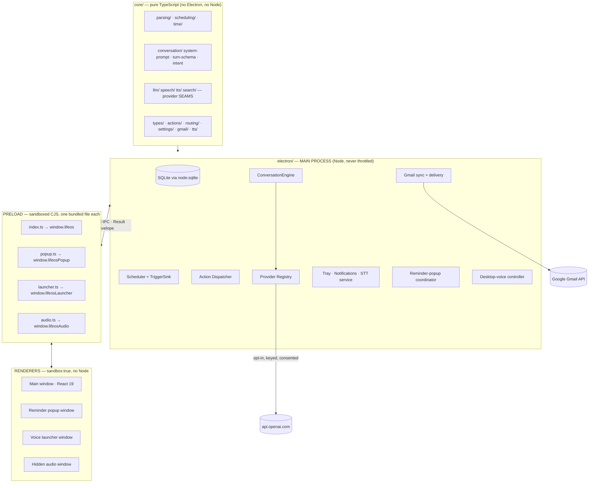
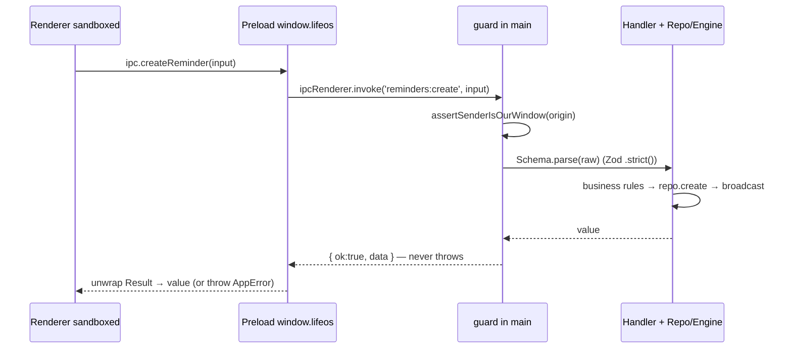
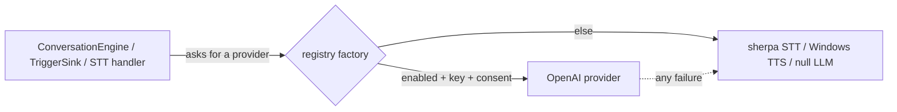
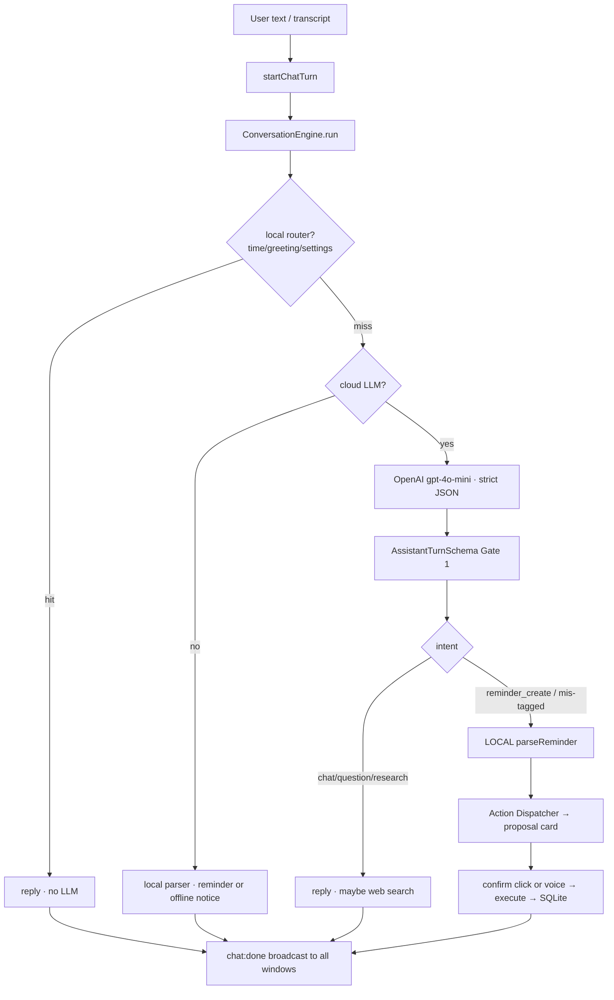
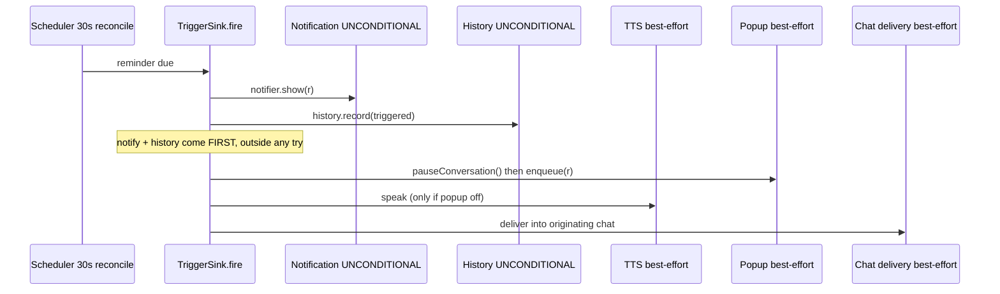
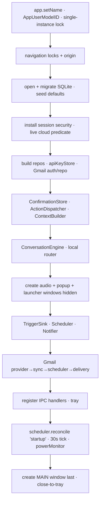

# Architecture

> **Home:** [docs/README.md](./README.md) · **Related:** [BACKEND](./BACKEND.md) · [FRONTEND](./FRONTEND.md) · [IPC](./IPC.md)

LifeOS is a standard-but-hardened Electron application: one privileged **main process** (Node), several **renderer windows** (sandboxed Chromium), and **sandboxed preload** bridges between them. The valuable, portable logic lives in a pure-TypeScript **`core/`** layer with no Electron or Node imports.

## 1. Layered architecture

`core/` is imported by `electron/` and `src/` but imports nothing from them (enforced by ESLint `no-restricted-imports` — `eslint.config.js`). This is the single rule that keeps the framework decision reversible.

## 2. Processes & windows

| Surface | Role | Key file |
| --- | --- | --- |
| **Main process** | The privileged Node loop. Owns SQLite, the scheduler, tray, notifications, STT service, ConversationEngine, Action Dispatcher, provider registry, Gmail, and the popup/launcher coordinators. | `electron/main/index.ts` (the composition root) |
| **Main window** | The primary React UI: rail nav (Chat / Schedules / History / Settings), chat with a sessions sidebar, mic capture. | `src/app/App.tsx` |
| **Hidden audio window** | TTS playback host: OS `speechSynthesis` OR streamed OpenAI audio via Media Source Extensions. Created hidden at startup. | `src/audio-host.ts` |
| **Reminder popup window** | Frameless, always-on-top toast that is *also* a chat client. Shown inactive (never steals focus). | `src/popup/PopupApp.tsx` + `electron/main/reminder-popup.ts` |
| **Voice launcher window** | Frameless, always-on-top floating widget triggered by `Alt+Shift+Space`; a compact live chat. | `src/launcher/LauncherApp.tsx` + `electron/main/desktop-voice/controller.ts` |

All four windows are created in `electron/main/windows.ts`; the audio, popup, and launcher windows are created hidden at startup so they inherit the secured session.

### The `fanout` linchpin

The main process broadcasts conversation/action/TTS/popup events to **every** window via a `fanout()` helper (`electron/main/index.ts:84`), with a `fanoutExcept()` variant that skips the originating window to avoid double-rendering (`:92`). This is what lets the launcher, the popup, and the main chat share **one live conversation** — every consumer self-filters by `turnId` / `sessionId`.

## 3. IPC & the security boundary

Every invoke handler is wrapped by `guard()` (`electron/main/ipc/guard.ts`): it checks the sender origin, runs the handler, and returns a `Result<T>` envelope — handlers **never reject**, and a stack trace never crosses IPC. Input is validated with Zod `.strict()` (an unknown key is a rejection). The renderer only ever holds named bridge functions; it never sees `ipcRenderer`. See [IPC](./IPC.md) for the full contract and channel list.

**Network is default-deny.** `installSessionSecurity()` (`electron/main/session.ts`) installs a CSP response header, a request filter that cancels any outbound request not on the allowlist, and a permission handler that grants only the microphone. The allowlist is empty except `api.openai.com`, and only when a cloud capability is enabled + keyed + consented. See [PERFORMANCE §privacy](./PERFORMANCE.md) and [IPC §security](./IPC.md).

## 4. The provider-seam pattern (privacy gating)

Every cloud capability sits behind a **pure interface in `core/`** (`LlmProvider`, `SpeechProvider`, `TextToSpeechProvider`, `SearchProvider`, `TranscriptCleaner`). Concrete OpenAI implementations live in `electron/providers/`. A **registry factory** (`electron/providers/registry.ts`) returns the cloud provider **only** when that capability is enabled + keyed + consented; otherwise a local provider or `null`.

Factories are **re-run per turn** (live rebind), so toggling AI Assist takes effect without a restart. Web search is deliberately a *separate* seam from the LLM. See [AI_INTEGRATIONS](./AI_INTEGRATIONS.md).

## 5. Conversation turn flow

**Two invariants** the engine guarantees (`electron/conversation/conversation-engine.ts`): exactly one `chat:done` per turn (even on a throw), and **the LLM never actuates** — a reminder's fields always come from the local parser, never from raw LLM output. See [AI_INTEGRATIONS](./AI_INTEGRATIONS.md) and [REMINDER_SYSTEM](./REMINDER_SYSTEM.md).

## 6. Reminder trigger flow (reliability-ordered)

The scheduler is wall-clock authoritative (a 30s reconcile query, never a far-future timer) and handles missed-while-closed reminders. See [REMINDER_SYSTEM](./REMINDER_SYSTEM.md).

## 7. Startup sequence

From `electron/main/index.ts`, `app.whenReady()`:

## 8. Data model (bird's-eye)

SQLite at `%APPDATA%\LifeOS\lifeos.db`, WAL, **schema version 8**, **18 tables**. Core entities: `reminders` (+ `reminder_history`), `chat_sessions` (+ `chat_turns`), `settings`, `app_logs`, `memories` (unused), `conversations` (unused telemetry), and 10 Gmail tables (`gmail_*`, `email_ai_context`, `web_research`). Full schema in [DATABASE](./DATABASE.md).

## 9. Reliability & provider principles (summary)

- **Reliability:** in the trigger path, notification + history are unconditional and fire first; everything else is individually wrapped best-effort.
- **Provider seam:** every cloud capability is a pure interface gated by enable + key + consent; the engine degrades gracefully to local providers or `null`.
- **Actuation gate:** the LLM never writes; a reminder is created only via the local parser → Action Dispatcher → single execution layer.
- **One conversation, many windows:** `fanout`/`fanoutExcept` + self-filtering keeps the main chat, popup, and launcher in sync.

## 10. Known architectural gaps

- The **voice launcher and reminder popup are not yet in the top-level architecture diagram** in the legacy planning docs (they are here).
- The **reminder popup is not yet a subscriber** to the live cross-window turn stream (the same fanout pattern would extend it).
- **State-based navigation** (no router) in the renderer — fine for 4 screens.
- STT decode runs on the **main thread** (fast, RTF ~0.07, but a worker would isolate it).

See [ROADMAP §technical debt](./ROADMAP.md) for the full list.
