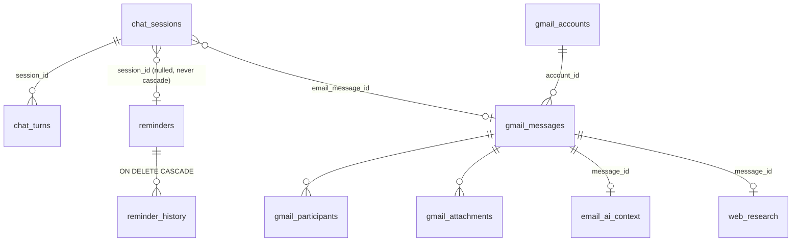

# Database

> **Home:** [docs/README.md](./README.md) · **Related:** [BACKEND](./BACKEND.md) · [REMINDER_SYSTEM](./REMINDER_SYSTEM.md)

LifeOS persists **everything** in one SQLite file: `%APPDATA%\LifeOS\lifeos.db` (dev: `%APPDATA%\lifeos\`), plus its `-wal`/`-shm` sidecars. WAL mode, foreign keys on, **schema `user_version` 8**, **18 tables**.

Files: `electron/database/`.

## 1. The driver abstraction

All SQL flows through a 6-method `SqliteDriver` interface (`driver.ts`): `exec`, `get<T>`, `all<T>`, `run`, `transaction<T>`, `close`. The concrete driver is `NodeSqliteDriver` (`drivers/node-sqlite-driver.ts`), backed by `node:sqlite` (built into Electron 43 — no native module).

- **createRequire shim** (`node-sqlite-driver.ts:17-19`): `node:sqlite` is loaded via a runtime `require` through a non-`require`-named binding so bundlers (Vite/Vitest) don't try to resolve a package named `sqlite`.
- Swapping to `better-sqlite3` is a one-file change — this is what keeps the choice reversible.

`openDatabase(dbPath)` (`open.ts`) instantiates the driver, runs PRAGMAs (`journal_mode=WAL`, `foreign_keys=ON`, `busy_timeout=5000`, `synchronous=NORMAL`), then calls `migrate(db)`.

## 2. Migrations

Migrations are inline SQL string constants in `migrations.ts` (bundled into the build, zero path-resolution risk). **Forward-only: no `DROP TABLE`, no `DROP COLUMN`, ever.**

`migrate(db)` (`migrate.ts`) reads `PRAGMA user_version` and applies each pending migration inside a transaction, bumping the version. If the DB is from a **newer** version than this build knows, it throws `DatabaseFromNewerVersionError` and refuses to open (never migrates backward).

| # | Migration | Adds |
| --- | --- | --- |
| M001 | `INITIAL` | `reminders`, `reminder_history`, `settings`, `app_logs` + indexes |
| M002 | `MEMORY` | `memories`, `conversations` (**both unused today**) |
| M003 | `CHAT_SESSIONS` | `chat_sessions`, `chat_turns` + `ALTER reminders ADD session_id` |
| M004 | `TURN_KIND` | `ALTER chat_turns ADD kind` (`'chat'` \| `'reminder'` \| `'email'`) |
| M005 | `REMINDER_EXECUTION` | `ALTER reminders ADD execution_json` (AI-task spec, nullable) |
| M006 | `GMAIL` | 8 Gmail tables (`gmail_accounts`, `gmail_sync_state`, `gmail_threads`, `gmail_messages`, `gmail_participants`, `gmail_labels`, `gmail_message_labels`, `gmail_attachments`) |
| M007 | `EMAIL_CONTEXT` | `email_ai_context` + `ALTER chat_sessions ADD email_message_id` |
| M008 | `WEB_RESEARCH` | `web_research` + `ALTER email_ai_context ADD research_worthwhile, research_query` |

## 3. Entity relationships

## 4. Core tables

### `reminders`
The heart of the app. Key columns: `scheduled_at` (original intent, epoch-ms) vs **`next_fire_at`** (what the scheduler compares against), IANA `timezone`, `recurrence_rule` (RRULE or NULL), `action_type` (`notify`\|`sing`), `status` (`pending`\|`triggered`\|`completed`\|`dismissed`\|`cancelled`\|`missed`\|`error`), `source` (`local`\|`llm`\|`manual`), `is_paused`, **`session_id`** (nullable, links to the chat that made it — app-managed, never cascades), **`execution_json`** (AI-task spec or NULL).

Hot index: `idx_reminders_due` — a **partial** index on `(next_fire_at)` where `status='pending' AND is_paused=0` (the scheduler's hot query).

### `reminder_history`
Execution + user-action log. FK → `reminders` **ON DELETE CASCADE**. `title_at_time` is denormalized (history is a log, not a view — it doesn't change if a reminder title is edited). `action_taken` ∈ `triggered`/`dismissed`/`completed`/`snoozed`/`missed`/`failed`.

### `chat_sessions` / `chat_turns`
`chat_sessions`: resumable chat threads; `updated_at` orders the sidebar; `email_message_id` links a chat to the email it was created for (NULL = normal chat).

`chat_turns`: **the faithful render source** — one row per turn, `id == engine turnId`, `assistant_text` = exactly what was shown, `kind` (`chat`/`reminder`/`email`), `proposal_summary` + `proposal_status` (NULL\|`pending`\|`executed`\|`cancelled`) + `reminder_id` for proposal turns. Distinct from the unused `conversations` telemetry table.

### `settings`
Key/value TEXT store (50 keys). Typed accessor layer. `ai_key_ciphertext`, `gmail_token_ciphertext`, `gmail_client_secret_ciphertext` hold DPAPI ciphertext and are **excluded from `getAllSafe()`** — never returned over IPC. See [SETTINGS](./SETTINGS.md).

### `app_logs`
Local, level-gated diagnostics with secret redaction (also records web-search decisions).

### `memories` / `conversations` (⛔ unused)
`memories` (M002): schema for subject/fact/category facts with `is_sensitive`. Wired into `ContextBuilder` as an empty slot but **no extraction/recall/UI** — see [MEMORY](./MEMORY.md). `conversations` (M002): best-effort chat telemetry, distinct from the faithful `chat_turns`, currently unwritten.

### Gmail tables (10)
`gmail_accounts`, `gmail_sync_state` (the `history_id` incremental cursor), `gmail_threads`, `gmail_messages` (unique message id → dedup), `gmail_participants`, `gmail_labels`, `gmail_message_labels`, `gmail_attachments`, `email_ai_context` (summary/intent/action-items/dates/priority + research decision), `web_research` (cached search answer per email). See [AI_INTEGRATIONS §Gmail](./AI_INTEGRATIONS.md).

## 5. Repositories

Each repository wraps the driver with parameterized queries (no string interpolation).

| Repository | Key methods |
| --- | --- |
| **ReminderRepository** | `create(input, sessionId)`, `get`, `listActive`, `listAll`, **`findDue(nowMs)`** (scheduler hot path, `LIMIT 20` storm guard), `update`, `delete`, `setPaused`, `setNextFireAt`, `markTriggered`/`markCompleted`/`markMissed`/`markDismissed`, `snooze` |
| **ChatRepository** | `createSession`, `createEmailSession`, `listSessions`, **`mostRecentConversation`** (excludes email), **`mostRelevantConversation`** (all kinds, email wins a tie), `findSessionByEmail`, `getSession`, `rename`, `touch`, **`deleteSession`** (transactional: delete turns → **null** linked reminders → delete session), `recordTurn`, `recordReminderDelivery`, `recordEmailDelivery`, `resolveProposal`, `getTurn`, `loadTurns`, `recentTurns(limit)` |
| **HistoryRepository** | `record(reminderId, titleAtTime, at, action)`, `list(filter)` |
| **SettingsRepository** | `seedDefaults`, `get`, `set`, `getAllSafe` (excludes 3 ciphertext keys), `hasApiKey` |
| **ConversationRepository** | `record(...)` — telemetry only, currently unwired |
| **GmailRepository** | account CRUD, sync-state (`setHistoryId`, `setSyncStatus`), message upsert/dedup/prune, label/participant/attachment writes, AI-context + web-research cache, `deleteEmailCache`, `messageCount`, `storageBytes` |

### Reminders outlive chats

Deleting a chat **must never** delete reminders it spawned. `ChatRepository.deleteSession` runs `UPDATE reminders SET session_id = NULL WHERE session_id = ?` — an app-level null-out, not an FK cascade. (The only cascade in the reminder graph is `reminder_history` when a reminder itself is deleted.)

## 6. Row mapping

`rows.ts` maps snake_case SQLite rows to camelCase domain objects (`toDomain`, `historyToDomain`). `execution_json` is defensively parsed (`parseExecutionSpec`) — a corrupt or legacy blob fails safe to `null`. Rows never leave the main process; the domain model is what crosses IPC.

## 7. Reset & cleanup

- **Reset local data:** Settings → type `RESET` → `settings:reset` (no args; path resolved in main from `app.getPath('userData')`) → best-effort Google OAuth revoke if connected → close DB → delete `lifeos.db` (+ sidecars, with retries) → best-effort wipe of the rest of the Electron profile → `app.relaunch()`. See [SETTINGS §reset](./SETTINGS.md) and `electron/services/reset-service.ts` (the only file allowed to import `fs`, guarded by `assertSafeResetPath`).
- **Log retention:** configured conceptually but **no cleanup job is wired** (technical debt — see [ROADMAP](./ROADMAP.md)).

## Discrepancy note

The status doc's "Current Database" summary once said "schema version 4, 8 tables." The source truth is **user_version 8, 18 tables** (M001–M008). The Gmail work (M006–M008) added 10 tables. This doc reflects source.
