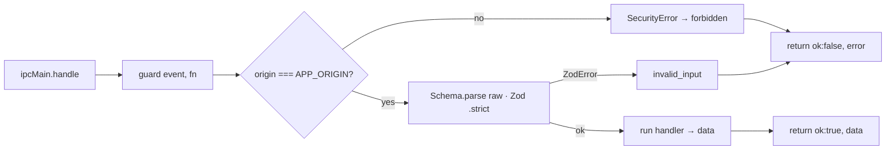

# IPC & The Security Boundary

> **Home:** [docs/README.md](./README.md) · **Related:** [ARCHITECTURE](./ARCHITECTURE.md) · [BACKEND](./BACKEND.md) · [FRONTEND](./FRONTEND.md)

IPC is the only channel between the sandboxed renderers and the privileged main process. It is deliberately narrow: named bridge functions (no raw `ipcRenderer`), origin-checked, Zod-validated, and wrapped in a `Result<T>` envelope so handlers never reject.

## 1. The preload bridges

Each window exposes exactly one frozen bridge object via `contextBridge`. **Never** `ipcRenderer` or a generic `invoke()`; listener callbacks strip the `IpcRendererEvent` (its `.sender` is a privilege-escalation handle).

| Window | Bridge | Preload | Channels |
| --- | --- | --- | --- |
| Main | `window.lifeos` | `electron/preload/index.ts` | **imports `CH`** from `core/types/channels.ts` |
| Reminder popup | `window.lifeosPopup` | `electron/preload/popup.ts` | channel strings **inlined** |
| Voice launcher | `window.lifeosLauncher` | `electron/preload/launcher.ts` | channel strings **inlined** |
| Hidden audio | `window.lifeosAudio` | `electron/preload/audio.ts` | channel strings **inlined** |

### The "single bundled file / no code-split chunk" invariant

A sandboxed preload cannot `require()` across files. If a second preload imported `channels.ts` (which imports nothing), Rollup would still split the shared import into a chunk that every preload `require()`s → crash → `window.lifeos` undefined (a historical blank-screen bug). So **only `index.ts` imports `channels.ts`; the popup/launcher/audio preloads inline their channel strings.** This invariant is currently enforced by the electron-vite preload output config (`format:'cjs'`, `entryFileNames:'[name].js'` + `externalizeDepsPlugin`) — **not** by a build-check script (the planning docs' "verify `out/preload/chunks` absent" is a manual check, not automated).

## 2. The `guard()` contract

`electron/main/ipc/guard.ts`:

- `guard()` checks `isSenderOurWindow(event.senderFrame)` (URL origin === `APP_ORIGIN`), runs the handler, and returns `{ ok, data | error }`. **Handlers never throw across IPC.**
- Errors are sanitized by `toIpcError`: `ValidationError` → its user message; `ZodError` → `invalid_input`; `SecurityError` → `forbidden`; anything else → `internal_error` (full detail logged locally; **no stack trace crosses IPC**).
- Launcher handlers add a **stricter** check on top: `event.sender.id === launcherWindow.webContents.id` (`launcher.ts`).
- The renderer-side `src/lib/ipc.ts` unwraps `Result<T>` into a returned value or a thrown `AppError`.

## 3. Channel inventory

`CH` is defined in `core/types/channels.ts` — **62 constants**. The file is dependency-free by design (the sandboxed preload imports it). Direction: **invoke** = renderer→main request/response; **broadcast** = main→renderer push (`fanout`); **send** = fire-and-forget.

### Reminders
`reminders:create/list/get/update/delete/pause/history/complete/dismiss/snooze` (invoke) · `reminders:changed` (broadcast) · `reminder:trigger` (broadcast, in-app modal) · `overdue:take` (invoke).

### Settings & app
`settings:get/update/resetLocalData/openDataFolder/setApiKey/clearApiKey/validateApiKey` (invoke) · `settings:changed` (broadcast) · `app:version` (invoke) · `app:navigate` (broadcast — local "open settings" command).

### Parse
`parse:reminder` (invoke — NL→reminder parse in main; used by `LegacyChatScreen`).

### Chat / conversation
`chat:send` (invoke → `{turnId}`) · `chat:cancel` · `chat:sessions:list` · `chat:session:create/turns/rename/delete` · `chat:activeSessionSet` (invoke — reports the open chat for launcher continuity). Broadcasts: `chat:done` (`{turnId, reply, parse, proposal?}`), `chat:searching` (`{turnId, sessionId}`), `chat:turn:started` (`{sessionId, turnId, userText}`, except-origin), `chat:turn:appended` (`{sessionId, turn}`), `chat:sessionsChanged`, `chat:delta` (**idle** — reserved for streaming).

### Action dispatcher
`action:confirm` / `action:cancel` (invoke — execute or discard the **stored** proposal for a turnId; no action payload) · `action:expired` (broadcast — proposal timed out = cancel) · `action:resolved` (broadcast — resolved by voice).

### TTS
`tts:preview` / `tts:stop` (invoke) · `tts:speaking` (broadcast — `{active}`, drives the Stop-speaking button).

### Speech / STT
`speech:start` (invoke → `{started, supportsPartials}`) · `speech:stop` (invoke — **return value IS the final transcript**) · `speech:audio` (**send** — high-freq PCM frames, fire-and-forget, size-guarded) · `speech:partial` / `speech:error` (broadcast). `SPEECH_FINAL` was deliberately removed.

### Popup (reminder popup window)
`popup:show` (main→popup) · `popup:action` (invoke — Complete/Dismiss/Snooze/✕) · `popup:message` (invoke — typed/spoken lifecycle-or-chat).

### Launcher (voice launcher window)
`launcher:beginListening` / `launcher:stopListening` (main→launcher) · `launcher:stateGet` · `launcher:stateChanged` (broadcast) · `launcher:sessionActivated` (broadcast) · `launcher:sendTranscript` / `discardTranscript` / `reviewReady` / `hoverChanged` / `interactive` / `error` / `listSessions` / `openConversation` (invoke).

### Gmail
`gmail:setCredentials` (invoke — write-only) · `gmail:connect/disconnect/test/deleteCache/syncNow` · `gmail:status:get` (invoke — returns the safe `GmailStatusDto`) · `gmail:status` (broadcast) · `gmail:openChat` (broadcast — `{sessionId}`).

### Audio window channels (not in `CH`)
Inlined only in `preload/audio.ts` and sent from `electron/main/tts/speak.ts`: `tts:speak`, `audio:playBytes`, `audio:ttsStart/ttsChunk/ttsEnd/ttsAbort`, `tts:cancel`, `audio:play/stop`, `audio:playbackError` (reverse), `audio:playing` (reverse). ~11 channels.

## 4. Payload schemas & DTOs

`core/types/ipc.ts` — all inputs are Zod `.strict()`:

- `CreateReminderInput`, `UpdateReminderInput`, `ReminderIdInput`, `PauseInput`, `HistoryFilterInput`, `SnoozeInput` — reminder operations, with `SUPPORTED_RRULE` (only `FREQ=DAILY`/`WEEKLY`) and IANA-zone validation.
- `SettingsPatch` — an **allow-list** of renderer-writable keys (deliberately **excludes** the API key and all Gmail secrets). See [SETTINGS](./SETTINGS.md).
- `GmailCredentialsInput` — clientId + clientSecret (write-only).
- Return DTOs (interfaces): `SettingsDto` (incl. `hasApiKey: boolean`, never the key), `GmailStatusDto` (booleans for secret presence, **no secrets**), `GmailSyncResultDto`, `ReminderDto`, `HistoryDto`.

## 5. Security properties (summary)

| Property | How enforced |
| --- | --- |
| Renderer can't reach Node | `sandbox:true`, `contextIsolation`, `nodeIntegration:false`; only named bridge fns |
| Only our window can call IPC | `guard()` origin check + launcher webContents-id check |
| Unknown input is rejected | Zod `.strict()` at every handler |
| Secrets never leave main | API key + Gmail tokens/secret are DPAPI ciphertext, excluded from `getAllSafe`; only `hasApiKey`/presence booleans cross IPC |
| Consent can't be faked | AI/STT/TTS consent timestamps are written **in main**, not by the renderer |
| A compromised renderer can't actuate | `action:confirm` carries only a `turnId`; it executes the stored proposal it was shown |
| Network default-deny | `session.ts` cancels any outbound request not on the allowlist |
| No remote navigation / webviews | `installNavigationLocks()` blocks non-origin navigation, denies `window.open`, prevents `<webview>` |

See [ARCHITECTURE §3](./ARCHITECTURE.md) for the sequence diagram and `electron/main/session.ts` for the network/CSP details.
