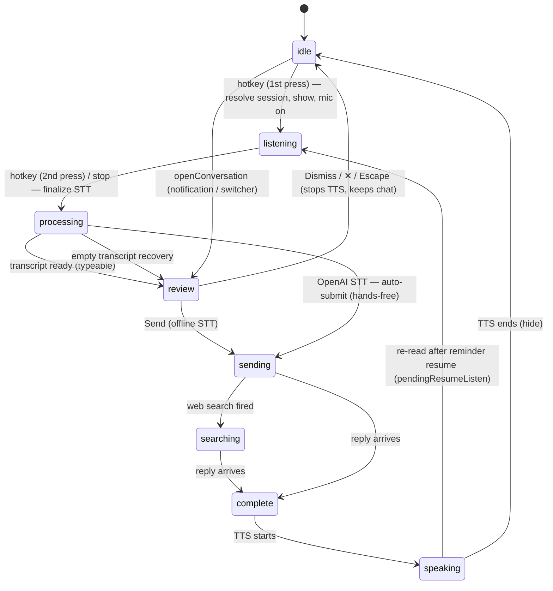
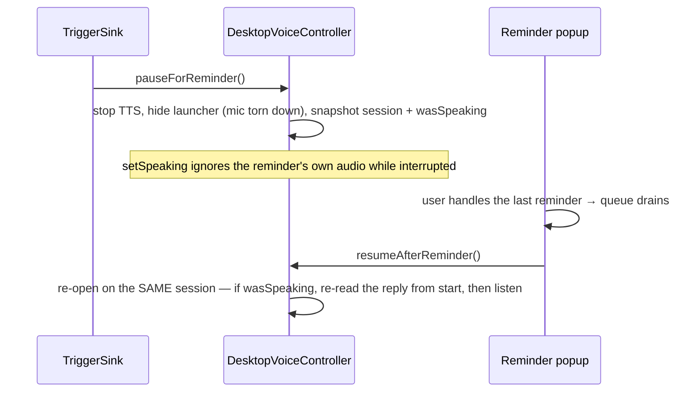

# Desktop Voice Launcher

> **Home:** [docs/README.md](./README.md) · **Related:** [VOICE_PIPELINE](./VOICE_PIPELINE.md) · [FRONTEND](./FRONTEND.md) · [BACKEND](./BACKEND.md)

The launcher is a **frameless, always-on-top floating widget** summoned by a global hotkey. It is the primary voice surface: press the key, talk, and Yogi answers — as a compact live chat that stays in sync with the main window. It shares the exact same `ConversationEngine` pipeline as the main chat.

Files: `electron/main/desktop-voice/controller.ts` (the state machine), `electron/main/ipc/launcher.ts` (the control surface), `src/launcher/LauncherApp.tsx` + `useLauncherMessages.ts` (the renderer), `src/launcher/launcher.css`.

## 1. Hotkey & window posture

- **Global shortcut `Alt+Shift+Space`** (`registerShortcut`), with a **400 ms debounce** ignoring OS key-repeat. Gated on `desktop_voice_shortcut_enabled` (and the launcher on `desktop_voice_launcher_enabled`).
- Window: **frameless, transparent, always-on-top** (`screen-saver` level), `skipTaskbar`, shown via `showInactive()` (**never steals focus**), positioned **bottom-right of the active display with a 16 px margin on every show**, 384 px wide (matches the reminder popup), with a slide-in animation. It remounts on each show so the entrance replays.
- **Clickability vs focus are decoupled** (`launcherApi.setInteractive`): the window *always* accepts mouse clicks while visible (so the ✕ and chat switcher always work), but keyboard focus (for the review textarea) only tracks the interactive flag — preserving "never steal focus."

## 2. Lifecycle state machine

The controller holds a `DesktopVoiceState` (`core/types/desktop-voice.ts`) and broadcasts it on every change (`launcher:stateChanged`). The launcher's resting state is **hidden** (`idle`).

- The launcher **stays visible through the whole response arc** (`sending → searching → complete → speaking`) so the user sees Searching/Thinking, the reply, and the Stop-speaking button; it returns to hidden only when `setSpeaking(false)` fires (TTS finished).
- A press while `processing`/`sending` is ignored; a press while `speaking` stops TTS and starts a fresh recording.
- **Empty-transcript recovery**: an empty final transcript lands in `review` (dismiss or type) instead of getting stuck.

### 2.1 Provider-specific STT flow (Offline vs OpenAI)

How a recognized transcript is handled depends on the **effective** STT provider, surfaced to the renderer as `DesktopVoiceState.sttAutoSubmit` (computed live in `electron/main/index.ts`: `stt_provider === 'openai' && hasApiKey && sttConsented` — the exact condition under which the cloud batch provider actually transcribes, so a silent sherpa fallback is never auto-sent):

| Provider | `sttAutoSubmit` | Flow after speech |
| --- | --- | --- |
| **Offline** (sherpa-onnx) | `false` | `processing → review`: editable draft + **Send**/**Dismiss** buttons. The user can edit before sending. *(unchanged)* |
| **OpenAI** (cloud) | `true` | Hands-free: `LauncherApp.onTranscript` calls `sendTranscript` immediately (`processing → sending`). **No review draft, no Send button.** The user's message appears in chat and the AI response starts automatically with the normal loading/search indicators. |

`sttAutoSubmit` is recomputed on every `snapshot()`, so switching the provider in Settings takes effect on the **next launch** with no restart (mirrors the speech handler's per-session provider rebind). The empty-transcript recovery is suppressed in the auto-submit path (`justAutoSubmittedRef`) so a stray `reviewReady` can't race the send. Consecutive OpenAI voice turns each auto-submit and continue the same conversation.

## 3. Conversation continuity

The launcher **continues the same conversation** across presses instead of minting a new chat each time. `resolveActiveSession()`:

1. If a **shared active-session pointer** exists and is at least as fresh as the top candidate → use it (so pressing the shortcut mid-conversation continues *that* chat).
2. Else the **most-relevant conversation** (`mostRelevantConversation` — most recently active of any kind, so a new email/reminder notification surfaces first).
3. Else create the first chat.

The shared pointer (`activeSessionId`, owned by `electron/main/index.ts`) moves on deliberate navigation only: the main window's `+ New chat` / manual select (via `chat:activeSessionSet`), or a launcher turn. This avoids a fired reminder (which bumps `updated_at`) hijacking which chat the launcher continues.

## 4. Real-time cross-window sync

The launcher renders as a **pure subscriber** (`useLauncherMessages`) — no optimistic list — to the shared turn broadcasts, so it receives its own turn's events too:

- `chat:turn:started` — user message + a "thinking" placeholder.
- `chat:searching` — flips the placeholder to "🔎 Searching the web…".
- `chat:turn:appended` — resolves to the final reply (sources included).

All chat turns flow through one main-process entry point (`startChatTurn`), which broadcasts to every window except the originator (`fanoutExcept`), so the main chat and the launcher show **one live conversation** with no double-render and no dedup. A launcher web search shows its status and sources in **both** windows.

## 5. Chat switcher

The header brand is the active conversation's title + a caret; clicking opens a dropdown (`role="listbox"`) of all conversations newest-first (📧/💬 kind icons, current one ✓). Selecting one calls `openConversation(sessionId)`, which lands the launcher in a typeable **review** state with that chat hydrated, moves the shared pointer, and tears down any live recording first. Escape closes the dropdown, then the launcher.

## 6. Conversation interruption (reminder pause/resume)

When a reminder fires during an active launcher conversation:

`setSpeaking` **ignores playback while interrupted**, so the reminder's audio ending can't collapse the paused launcher (a historical bug). Resume is gated by `conversation_auto_resume` (default on); re-reading the interrupted reply from the start is the pragmatic recovery (a mid-sentence resume is future work).

## 7. Notification navigation

A new-email or fired-reminder notification click opens the launcher **directly into that conversation** (`openConversation` via the shared `openSessionEverywhere` helper) when the launcher is enabled, else the main window. The main window mirrors via `gmail:openChat` / `launcher:sessionActivated`.

## 8. Security

Launcher IPC handlers add a **stricter** sender check than origin alone: `event.sender.id === launcherWindow.webContents.id` (throws `bad_launcher_sender` otherwise). See [IPC §2](./IPC.md).

## Status & gaps

✅ Built and unit-tested (28 controller tests) — hotkey/debounce, continuity, no-duplicate/no-empty sessions, the response arc, dismiss-stops-TTS, empty-transcript recovery, switcher DTOs, interruption pause/resume, notification navigation, and the `sttAutoSubmit` flag (offline default / OpenAI on / live re-derivation). The **GUI behaviours are verified by construction** (unit tests + code trace); a live Windows drive (physical ✕ click, on-screen switcher, real toast→launcher) is the standing manual-verification gap (no display in CI). The launcher was historically absent from the top-level architecture diagram (now covered in [ARCHITECTURE](./ARCHITECTURE.md)).
