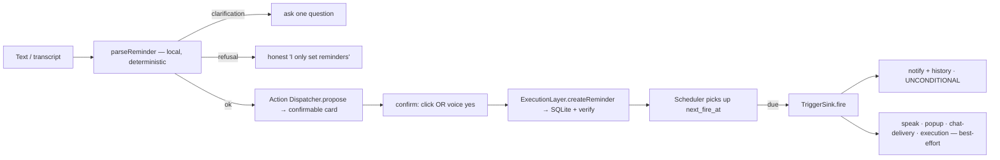
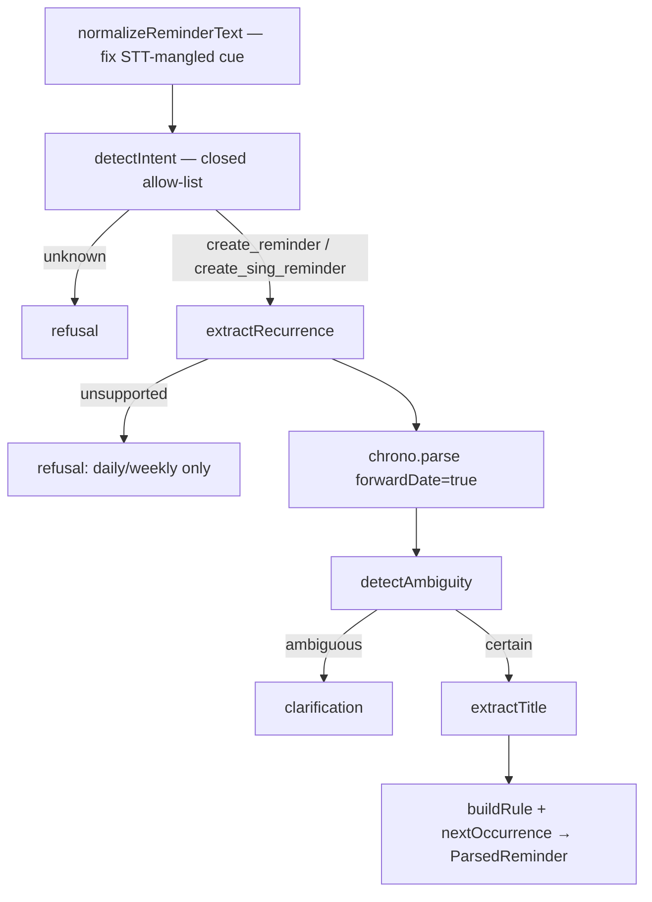
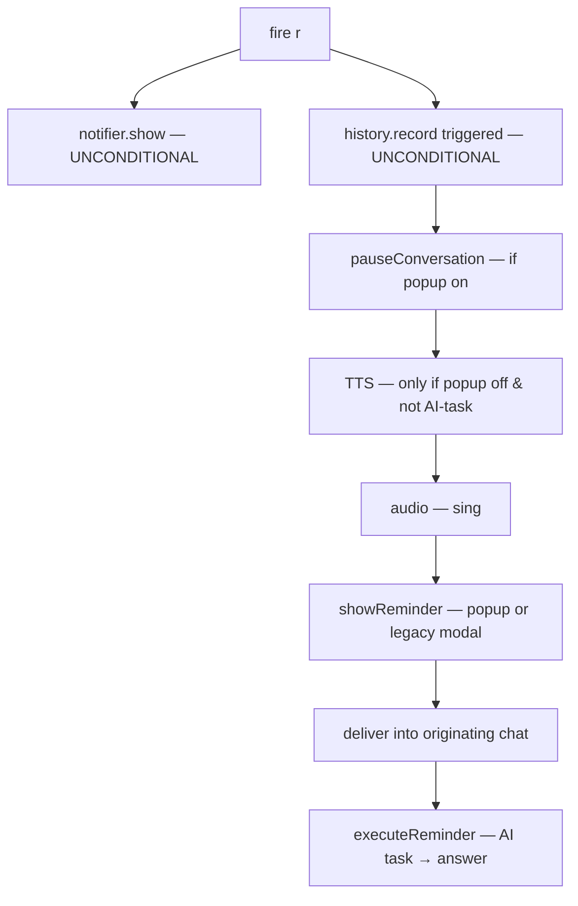

# Reminder System

> **Home:** [docs/README.md](./README.md) · **Related:** [AI_INTEGRATIONS](./AI_INTEGRATIONS.md) · [DATABASE](./DATABASE.md) · [BACKEND](./BACKEND.md)

The reminder loop is the reliability spine of LifeOS. It is fully local: a deterministic NL parser, a wall-clock scheduler, and a fan-out that guarantees the notification even if everything else fails.

## 1. The full loop

## 2. The NL parser (`core/parsing/parse-reminder.ts`)

A **pure, total function**: `text → ParseResult`. Ambiguity and refusal are *results*, not exceptions. Pipeline:

| Stage | File | Job |
| --- | --- | --- |
| Normalize | `normalize-reminder.ts` | Canonicalize an STT-mangled cue ("remained me" → "remind me"); clean text unchanged |
| Intent | `detect-intent.ts` | Closed allow-list of reminder verbs/nouns (broad: "remind me", "set/add/create/make/schedule reminder", "set me a reminder", noun-led "reminder after…", "ping/nudge/wake me", "don't forget"); everything else → `unknown` |
| Recurrence | `extract-recurrence.ts` | Detect daily/weekly (chrono can't); reject anything else as unsupported |
| Time | chrono-node | `forwardDate: true` is mandatory (else "Friday" on a Friday means *last* Friday) |
| Ambiguity | `detect-ambiguity.ts` | Missing time, AM/PM ambiguity, vague daypart, recurrence-without-time, missing title → ask, never guess |
| Title | `extract-title.ts` | Strip the verb prefix + date text → a clean title ("Call Biplab") |
| Confidence | `score-confidence.ts` | A confidence score for the card |
| Build | `rrule.ts` + `next-occurrence.ts` | RRULE string + the concrete `next_fire_at` (Luxon, DST-correct) |

**56 fixtures** in `tests/fixtures/commands.json` exercise this end to end.

## 3. Ambiguity & clarification

The parser **asks instead of guessing**. Examples (`clarification.ts`): "remind me at 9" → "9 AM or 9 PM?"; "remind me to exercise" (no time) → asks for a time; "remind me tomorrow" (no title) → asks what for. In a conversation the follow-up answer combines with the pending reminder (online via LLM history; offline via the engine's clarification-combine).

## 4. The Action Dispatcher (confirmation gate)

Nothing persists without confirmation. `electron/actions/`:

- **`propose`** — validates business rules (Gate 2: no past time, ≤2 years out, no sing+recurring), stores a single-use proposal in `ConfirmationStore` (90s timeout = **cancel**, never auto-confirm), returns a display proposal.
- **`confirm(turnId)`** — executes the **stored** action (the renderer submits no payload, so it can't confirm an action it wasn't shown). Catches an execution throw and returns a failure (so success is never claimed for a reminder that wasn't stored + scheduled).
- **`ExecutionLayer`** (`execute.ts`) — the **only** mutator; `reminder_create` calls the same `persistReminder` the direct path uses, which **reads the row back** and requires a `next_fire_at` before returning success.

Confirmation is by **button click** *or* **spoken "yes"** (the voice-confirm matcher resolves the open proposal deterministically in main). See [AI_INTEGRATIONS §2](./AI_INTEGRATIONS.md).

## 5. The scheduler (`electron/scheduler/scheduler.ts`)

**Wall-clock authoritative**: the persisted `next_fire_at` is the source of truth; timers are only an optimization.

- **Never `setTimeout` to a reminder's due time** — delays above 2³¹−1 ms (~24.8 days) fire *immediately*. Instead a **30s reconcile** queries `findDue(now)` (the partial index hot path, `LIMIT 20` storm guard).
- **Reconcile causes**: `startup`, `tick` (every 30s), `resume`/`unlock` (`powerMonitor`), `mutation` (a create nudges it). Paused → no-op.
- **Missed-while-closed policy** (`cause==='startup'` and late by > 2 ticks):
  - **One-time**: marked `missed` + a history row + surfaced once via the OverdueModal — honest, not a fake alarm hours late.
  - **Recurring**: **rolled forward** past now without firing (firing four missed "Exercise" alarms at once is hostile).

## 6. The trigger fan-out (`electron/scheduler/trigger-sink.ts`)

Read the ordering as the reliability argument:

Notification + history are **outside any try** and come first. Everything else is individually wrapped (`safely(...)`) — a throw in TTS/popup/chat-delivery can never prevent the toast. A silent reminder is still a reminder; a missed reminder is a bug.

## 7. The reminder popup (`electron/main/reminder-popup.ts` + `src/popup/`)

The primary fired-reminder surface: a frameless, always-on-top toast that is **also a chat client**. Shown **inactive** (never steals focus), bottom-right of the cursor's display.

- **FIFO queue**: one reminder shown at a time; more queue behind it with a "+N more" chip (no overlapping voices).
- **Actions**: Complete / Snooze / Dismiss buttons, **or** natural language ("mark it done", "snooze an hour"), **or** ask a follow-up that continues the reminder's chat. Delete is gated by a yes/no confirm.
- The popup is the **sole speaker** when enabled (a natural line: "Hi there. It's time to <title>."), so the sink's TTS stands down to avoid a clipped double.
- **Queue drain** → `onQueueDrained` → resume any conversation the reminder paused.
- The coordinator is **electron-free** (window + position injected) so its queue/lifecycle state machine is unit-tested (`tests/unit/reminder-popup.test.ts`).

When the popup is disabled, the in-app **TriggerModal** (`src/features/reminders/TriggerModal.tsx`) shows instead.

## 8. Recurrence

- Stored as an RRULE string (`rrule.ts`), computed forward with Luxon (`next-occurrence.ts`), DST-correct.
- Supported (2026-07-15): **`FREQ=DAILY` / `WEEKLY` / `MONTHLY` / `YEARLY`**, an optional **`INTERVAL`** (every-N), multiple weekdays (**`BYDAY=MO,WE,FR`**), and an end condition — **`COUNT`** (after N occurrences) or **`UNTIL`** (inclusive end instant), mutually exclusive.
- The model is **stateless and anchor-based**: `scheduledAt` is occurrence #1 and never moves; every later occurrence is `anchor.plus({unit: k*interval})` (computed from the anchor, so month-length clamping can't drift). `nextFireAfter` returns `null` when a bounded rule is exhausted → the scheduler marks the reminder `completed`.
- Monthly/yearly do **not** encode the day-of-month/month in the rule — it's implied by the anchor (keeps the "31st clamps to Feb 28 but returns to the 31st in March" case correct). `firstFireAt` snaps a weekly rule to its first selected weekday.
- The IPC layer validates rules via `parseRule` (`SUPPORTED_RRULE` in `core/types/ipc.ts` — one grammar, no drift).
- **Authoring:** the **reminder editor** (`src/features/schedules/ReminderEditor.tsx` + `repeat.ts`) exposes One time / Every day / week / month / year / Custom. **Chat NL (`extract-recurrence.ts`) still understands daily + weekly only** — monthly/yearly/custom are UI-only by design.

## 9. Reminder-execution (AI-task reminders)

A reminder whose title is a lookup ("remind me tomorrow to tell me NIT Hamirpur's contact") is classified as an AI task at creation (`classify-execution.ts`); at fire time the `ReminderExecutor` runs the web search and **speaks/delivers the answer** instead of the title. See [AI_INTEGRATIONS §6](./AI_INTEGRATIONS.md).

## 10. Lifecycle actions

| Action | Effect |
| --- | --- |
| Complete | `status='completed'`, history `completed` |
| Dismiss | `status='dismissed'`, history `dismissed` |
| Snooze | `status='pending'`, `next_fire_at = now + minutes`, history `snoozed` (one-time only) |
| Pause (recurring) | `is_paused=1` — excluded from the scheduler's hot query |
| Delete | removes the row (+ cascades its history); a linked chat's `session_id` was already app-managed |
| Edit | ✅ `ReminderEditor` modal on the Schedules screen (＋ New reminder / per-row Edit) — change name, date/time, and repeat settings; a reschedule re-arms the reminder (`status='pending'`, `next_fire_at` reset) |

## 11. Reminder → chat delivery

A reminder created inside a chat is delivered **back into that chat** as a `kind='reminder'` turn when it fires (`recordReminderDelivery` → `chat:turn:appended`), so the conversation can continue from it. A null-session reminder just notifies.

## Status

✅ The whole reminder loop is complete and human-verified — parse, ambiguity, confirm (click+voice), schedule, notify+speak, popup, **recurrence (daily/weekly/monthly/yearly + custom every-N, multi-weekday, COUNT/UNTIL)**, a **create/edit UI**, overdue catch-up, history, pause/resume, delivery, and AI-task execution. ⛔ Chat NL still parses daily/weekly only (advanced repeats via the editor). ⛔ "Sing" reminder has a parser branch + sink path but **no bundled MP3** (deferred).
