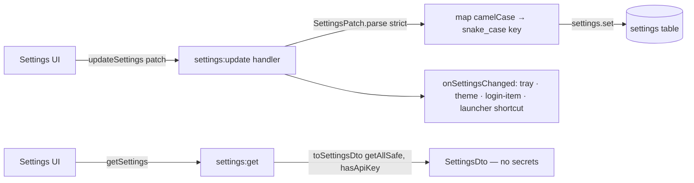

# Settings

> **Home:** [docs/README.md](./README.md) · **Related:** [IPC](./IPC.md) · [DATABASE](./DATABASE.md) · [AI_INTEGRATIONS](./AI_INTEGRATIONS.md)

Settings are a key/value TEXT store in SQLite (`settings` table) with a typed accessor layer. There are **50 keys** (`SETTING_DEFAULTS` in `electron/database/settings-repository.ts:6-86`). Values are stored as strings and coerced by `core/settings/typed-settings.ts`.

## 1. Read/write flow

- **Read**: `settings:get` → `toSettingsDto(settings.getAllSafe(), apiKeyStore.has())`. `getAllSafe()` **excludes the 3 ciphertext keys**; the DTO carries `hasApiKey: boolean`, never the key.
- **Write**: `settings:update` parses a `SettingsPatch` (Zod `.strict()` allow-list — never the API key or Gmail secrets), maps each field to its stored key, then runs `onSettingsChanged()` (refresh tray, sync theme via `nativeTheme`, reconcile the OS login item, re-register the launcher shortcut).
- **Consent is written in main**, not the renderer: toggling `aiEnabled`/`sttProvider`/`ttsProvider` also stamps `ai_consent_accepted_at` / `stt_consented_at` / `tts_consented_at`, so the UI cannot fabricate consent.
- **`seedDefaults()`** runs on every startup with `INSERT OR IGNORE` — new keys are additive; existing values are never overwritten (no migration needed for a new flag).

## 2. The 50 keys

### App & UI
| Key | Default | Purpose |
| --- | --- | --- |
| `onboarding_completed` | `false` | First-run gate |
| `tray_notice_shown` | `false` | Show the close-to-tray notice once |
| `reminders_paused` | `false` | Pause-all |
| `theme` | `system` | `system`\|`light`\|`dark` |
| `close_action` | `tray` | `tray`\|`quit` |
| `notification_sound` | `true` | Toast sound |
| `snooze_minutes` | `10` | Default snooze |
| `tick_interval_ms` | `30000` | Scheduler tick |
| `launch_at_login` | `false` | Start to tray at Windows login (opt-in) |

### Voice output (TTS)
| Key | Default | Purpose |
| --- | --- | --- |
| `tts_enabled` | `true` | Speak reminders/replies aloud |
| `tts_provider` | `web-speech` | `web-speech`\|`openai` |
| `tts_voice` | `calm` | Friendly voice key (6 personalities) |
| `tts_rate` | `1.0` | Speech speed |
| `tts_consented_at` | `''` | Cloud TTS consent (presence = consented) |
| `tts_degraded` | `false` | A cloud TTS attempt failed → use Windows next |
| `tts_voice_id` | `''` | Legacy/orphaned |

### Speech input (STT)
| Key | Default | Purpose |
| --- | --- | --- |
| `stt_provider` | `sherpa-onnx` | `sherpa-onnx`\|`openai` |
| `stt_model` | `gpt-4o-transcribe` | Cloud STT model |
| `stt_consented_at` | `''` | Cloud STT consent |
| `stt_cleanup_enabled` | `true` | LLM dictation cleanup (flag) |

### AI Assist (LLM)
| Key | Default | Purpose |
| --- | --- | --- |
| `ai_assist_enabled` | `false` | Master cloud-chat toggle |
| `ai_provider` | `openai` | Only OpenAI implemented |
| `ai_model` | `gpt-4o-mini` | Chat model |
| `ai_only_when_uncertain` | `true` | (config) |
| `ai_consent_accepted_at` | `''` | AI consent |
| `ai_last_used_at` | `''` | Telemetry |
| `ai_key_ciphertext` | `''` | 🔒 **DPAPI ciphertext — never over IPC** |
| `web_search_enabled` | `true` | Web-search tool (flag) |
| `search_model` | `gpt-4o-mini-search-preview` | Search model |

### Feature flags
| Key | Default | Purpose |
| --- | --- | --- |
| `conversation_ui_enabled` | `true` | New ChatScreen vs LegacyChatScreen |
| `dispatcher_enabled` | `true` | Reminder via Action Dispatcher vs direct |
| `voice_confirm_enabled` | `true` | Spoken yes/no confirmation |
| `reminder_popup_enabled` | `true` | Popup vs in-app TriggerModal |
| `desktop_voice_launcher_enabled` | `true` | The floating voice launcher |
| `desktop_voice_shortcut_enabled` | `true` | The `Alt+Shift+Space` shortcut |
| `conversation_auto_resume` | `true` | Resume a conversation after a reminder |
| `launcher_x` / `launcher_y` | `''` | (legacy window position) |

### Gmail
| Key | Default | Purpose |
| --- | --- | --- |
| `gmail_enabled` | `false` | Master Gmail toggle |
| `gmail_client_id` | `''` | OAuth client id (non-secret) |
| `gmail_notifications` | `true` | New-mail toasts |
| `gmail_ai_summaries` | `true` | LLM email summaries (needs key) |
| `gmail_store_context` | `true` | Store email bodies/context |
| `gmail_auto_research` | `false` | Auto web-research important emails |
| `gmail_download_attachments` | `false` | Download attachments (uses `format=full`) |
| `gmail_include_threads` | `true` | Include thread history |
| `gmail_sync_mode` | `5min` | `push`\|`5min`\|`15min`\|`manual` (push = 5min polling) |
| `gmail_max_stored` | `1000` | `1000`\|`5000`\|`unlimited` |
| `gmail_token_ciphertext` | `''` | 🔒 **DPAPI ciphertext** |
| `gmail_client_secret_ciphertext` | `''` | 🔒 **DPAPI ciphertext** |

## 3. Feature flags (behavioral)

All default **on** except `launch_at_login`. Six are backend **kill switches** with **no UI control** (flip via DB): `conversation_ui_enabled`, `dispatcher_enabled`, `voice_confirm_enabled`, `reminder_popup_enabled`, `web_search_enabled`, `stt_cleanup_enabled`. The launcher flags, `conversation_auto_resume`, and `launch_at_login` **are** UI-toggleable (Settings → Desktop Voice Launcher / Window & tray).

## 4. The Settings UI

`src/features/settings/SettingsScreen.tsx` groups, in order:

1. **Privacy** — local-only copy + "Open data folder".
2. **OpenAI** (`OpenAiKeySection`) — AI Assist toggle (consent-gated), **write-only** API key (Save/Validate/Remove; masked; never read back), STT provider select (consent-gated).
3. **Voice** (`VoiceSection`) — TTS provider (consent-gated), the 6-voice picker + hint, speed slider + readout, Preview (speaks a sample through the real TTS path).
4. **Gmail** (`GmailSection`) — status banner, credentials (write-only secret), Connect/Reconnect/Disconnect/Test/Sync-now, the feature toggles, sync mode, max-stored, status detail, delete-cache. See [AI_INTEGRATIONS §Gmail](./AI_INTEGRATIONS.md).
5. **Speech** — speak-aloud toggle.
6. **Desktop Voice Launcher** — launcher enable, global shortcut, resume-after-reminder.
7. **Reminders** — pause-all.
8. **Window & tray** — close action, start-at-login, theme.
9. **Danger zone** — Reset Local Data (type `RESET`).
10. **About** — version / Yogi / MIT.

Consent toggles open a `Modal` explaining what leaves the device before enabling.

## 5. Reset Local Data

Type `RESET` → `settings:reset` (no args; path resolved in main) → best-effort Google OAuth revoke (if connected) → close DB → delete `lifeos.db` (+ sidecars) → best-effort wipe the rest of the profile → `app.relaunch()` into onboarding. Everything LifeOS persists (reminders, chats, memories, settings, the encrypted API key + Gmail tokens, Gmail cache) is in that one DB file. See [DATABASE §7](./DATABASE.md) and `electron/services/reset-service.ts`.

## Note on the DTO

Not every stored key is surfaced in `SettingsDto` — the six kill-switch flags, consent timestamps, `stt_model`, `tts_degraded`, window positions, etc. are backend-only. The renderer sees only what it needs (and never a secret).

## Discrepancy note

The status doc once said "34 settings keys." The source has **50** (`settings-repository.ts:6-86`). The seeded cloud STT model default is `gpt-4o-transcribe` (the status doc's tech table implied `gpt-4o-mini-transcribe`, which is only the empty-value fallback).
