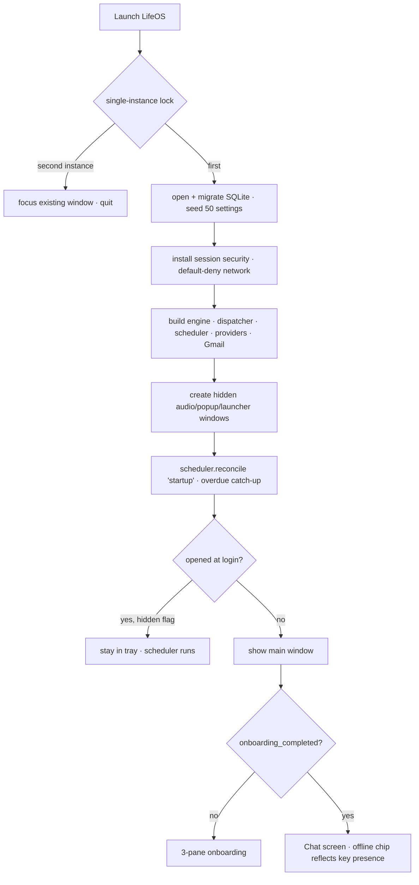
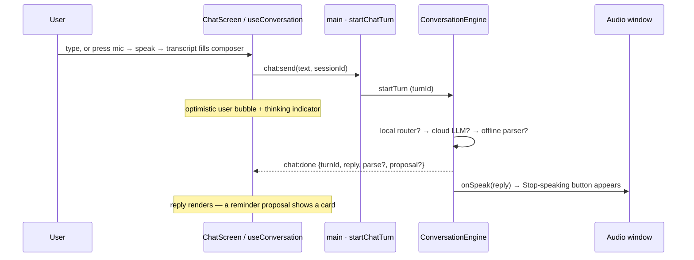
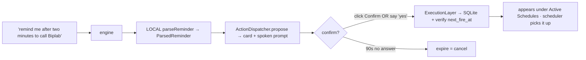
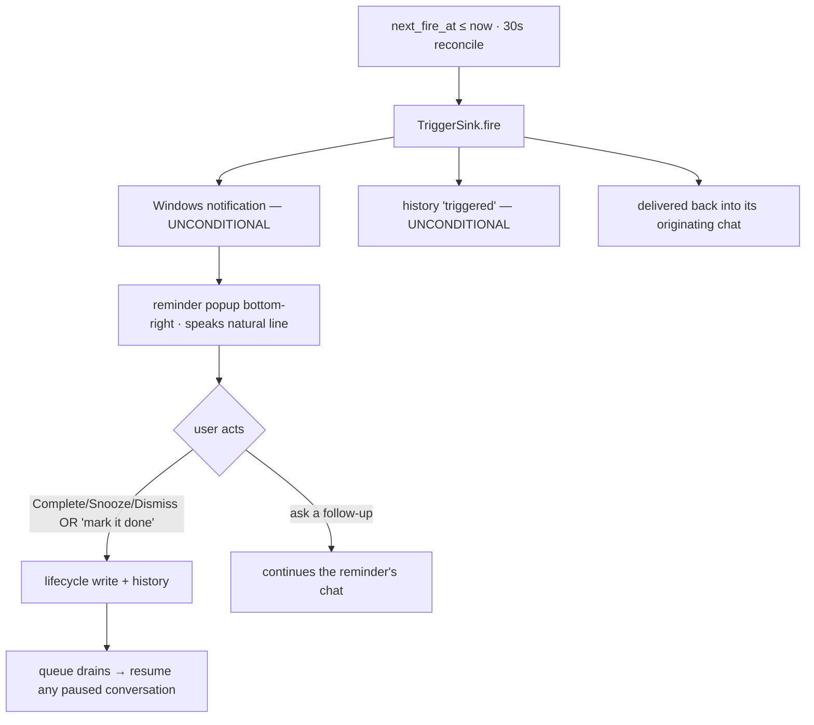
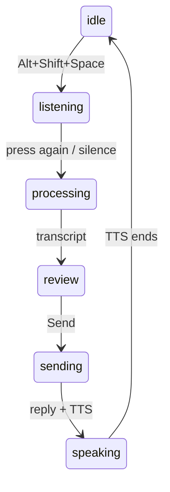
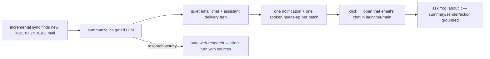
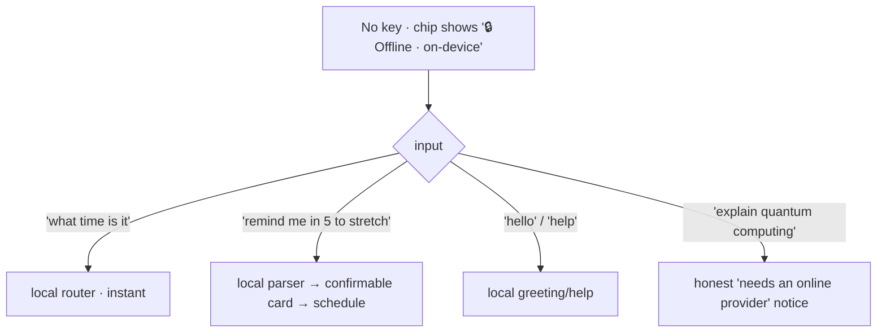

# User Flows

> **Home:** [docs/README.md](./README.md) · **Related:** [FEATURE_GUIDE](./FEATURE_GUIDE.md) · [ARCHITECTURE](./ARCHITECTURE.md)

End-to-end journeys, each traceable to source. These are the flows that work today.

## 1. App launch → ready

## 2. Conversation (typed or voice)

- Offline (no key): reminder-shaped input → local parser; time/greeting/settings → local router; genuine reasoning → honest "connect OpenAI" notice.
- Online: conversational reply, with a thinking / "🔎 Searching the web…" indicator, and a **Stop speaking** button while Yogi talks. Pressing the mic mid-speech interrupts.

## 3. Create a reminder (the confirmation gate)

The reminder shows the title, absolute + **live** relative time, and recurrence. Nothing persists until you confirm. See [REMINDER_SYSTEM](./REMINDER_SYSTEM.md).

## 4. Reminder fires

If it was an **AI-task** reminder, the executor runs the web search and speaks/delivers the answer instead of the title.

## 5. Voice launcher (hotkey → answer)

Press the hotkey anywhere → the launcher slides in bottom-right, listens, transcribes, and Yogi answers — as a compact live chat that stays in sync with the main window. See [LAUNCHER](./LAUNCHER.md).

## 6. Web-search question

"Contact number of NIT Hamirpur" → the engine classifies `research` → forces a search → "🔎 Searching the web…" in both windows → answer + Sources. On failure it says so honestly. See [WEB_SEARCH](./WEB_SEARCH.md).

## 7. New email (Gmail connected)

See [AI_INTEGRATIONS §Gmail](./AI_INTEGRATIONS.md).

## 8. Offline session (no API key)

Reminders, time/date, greetings, help, and "open settings"/"show schedules" all work with **zero network**. See [BACKEND §local-command-router](./BACKEND.md).

## 9. Manage & maintain

- **Schedules** — see/pause/delete upcoming reminders (live-ticking times).
- **History** — filter past events (All/Completed/Dismissed/Missed).
- **Settings** — key, voice, Gmail, theme, launch-at-login, close-to-tray, **Reset local data** (type `RESET` → wipe + relaunch to onboarding).
- **Tray** — Open / View schedules / Pause-all / Quit; the app lives in the tray (close-to-tray by default).

## 10. Pause / resume everything

Pause-all (tray / banner / settings) stops the scheduler firing; Resume reconciles to catch anything that came due while paused.
