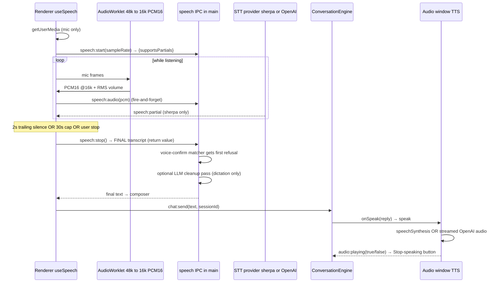
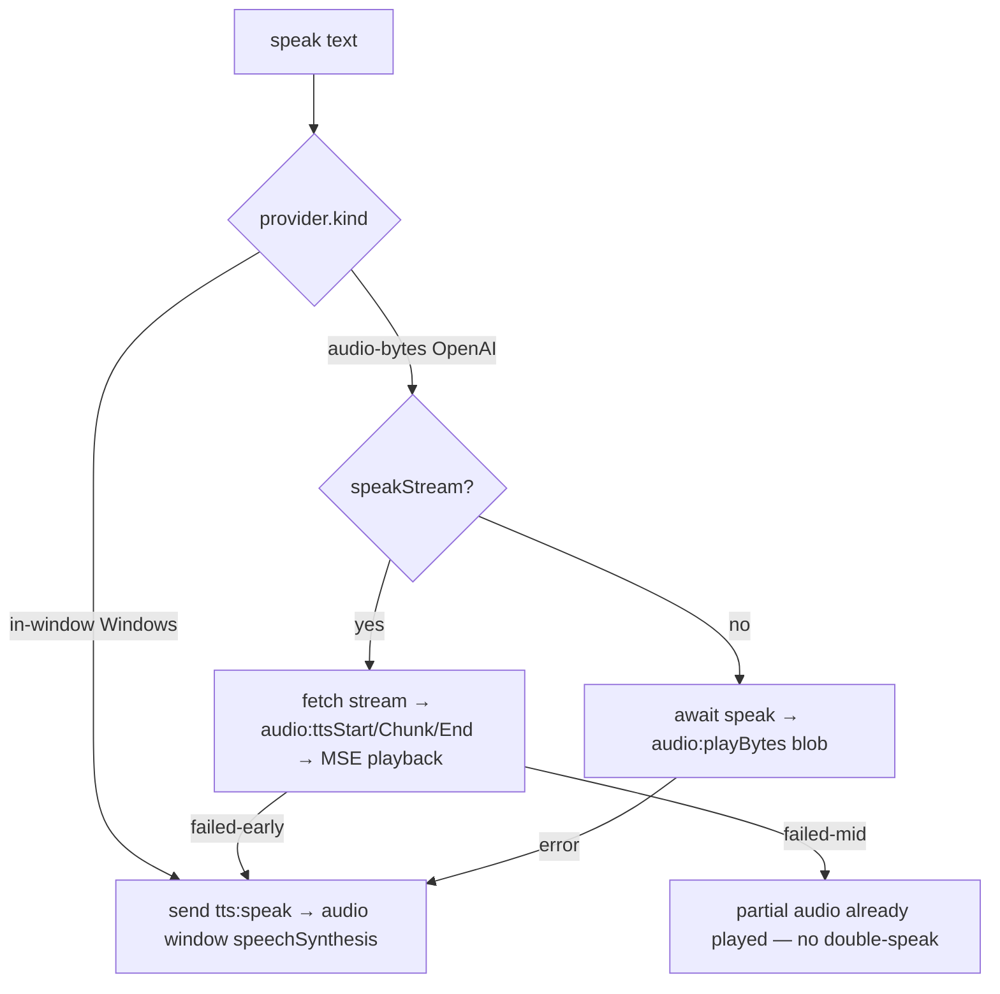

# Voice Pipeline

> **Home:** [docs/README.md](./README.md) · **Related:** [AI_INTEGRATIONS](./AI_INTEGRATIONS.md) · [LAUNCHER](./LAUNCHER.md) · [FRONTEND](./FRONTEND.md)

The voice pipeline turns a spoken utterance into a transcript, routes it through the conversation engine, and speaks the reply. It is fully offline by default (local STT + OS TTS) and upgrades to cloud providers only when opted in. The same pipeline drives the main chat, the reminder popup, and the voice launcher (the mic hook takes an injected bridge).

## 1. End-to-end sequence

## 2. Microphone capture (renderer)

`src/hooks/useSpeech.ts`:

- **Permission-safe**: `getUserMedia({ audio: { echoCancellation, noiseSuppression, channelCount:1 } })`. The mic is the only permission the app grants (`session.ts`). Every failure degrades to typed input.
- **Downsampling**: an `AudioWorklet` (`public/worklets/pcm16-downsampler.js`) converts the mic's native rate (usually 48k) to **16 kHz PCM16** and posts `ArrayBuffer` frames. `sherpa` also resamples internally, so main is told the real capture rate.
- **Live volume**: RMS of each frame drives the voice bars (`volume`).
- **Endpointing**: `SPEECH_RMS_THRESHOLD = 0.01` gates "is this speech?"; a speech frame (re)arms a **2s trailing-silence** auto-stop (`SILENCE_STOP_MS`). This runs for **both** transports, so a batch (OpenAI) provider — which emits no partials — also auto-stops instead of running to the **30s hard cap** (`HARD_CAP_MS`).
- **`beforeStart`**: pressing the mic while Yogi is speaking calls `beforeStart` → `tts.stop()`, so the mic **interrupts** speech.
- Audio frames go out over `speech:audio` (fire-and-forget, size-guarded to ≤64 KB); the **final transcript is the return value of `speech:stop()`** (there is no `speech:final` broadcast, so no double-apply).

## 3. Speech-to-text (main)

`electron/main/ipc/speech.ts` resolves the active STT provider **per session** from settings (live rebind) via the registry (`electron/providers/registry.ts`):

| Provider id | Backend | Gating | Partials? |
| --- | --- | --- | --- |
| `sherpa-onnx` (default) | `sherpa-onnx-node` streaming Zipformer (~68 MB int8) | none — on-device | ✅ live |
| `openai` | `gpt-4o-transcribe` batch WAV POST | key + STT consent | ⛔ "Transcribing…" |
| `whisper-cpp` (seam) | offline whisper.cpp N-API | on-device | ⛔ |
| `deepgram` (seam) | streaming cloud | key + consent | ✅ |

Only `sherpa-onnx` and `openai` are fully wired and UI-selectable; `whisper-cpp` and `deepgram` are optional seams that fall back to sherpa when their native module/key is absent. **Any cloud STT is wrapped in `withFallback(sherpa)`** — a bad key/network at init/start/stop degrades transparently to on-device. `speech:start` returns `supportsPartials` so the UI shows live ticks (sherpa) or a "Transcribing…" spinner (batch).

### Post-STT handling

On `speech:stop`, before the transcript reaches the composer:
1. **Voice-confirm matcher gets first refusal** — if a reminder proposal is pending, "yes/no/repeat" resolves it deterministically in main (never the LLM) and the transcript is consumed.
2. **Optional LLM cleanup pass** (`stt_cleanup_enabled`, online only) — cleans dictation punctuation/casing; best-effort, returns raw on any failure. Never applied to the yes/no path.

### STT-tolerant reminder normalization

Offline sherpa can mis-transcribe the reminder cue ("remind" → "remained"/"remains", leading "it/who"). `core/parsing/normalize-reminder.ts` uses bounded edit-distance to canonicalize a mis-heard verb *followed by "me"* back to "remind me" before parsing, so an offline dictated reminder isn't rejected. The gate ("followed by me") keeps "the remainder of 10" untouched. See [REMINDER_SYSTEM](./REMINDER_SYSTEM.md).

## 4. Text-to-speech (main → audio window)

`electron/main/tts/speak.ts` (`speakThroughAudioWindow`) picks the path from the provider's `kind`:

- **Streaming (preferred)**: OpenAI audio is streamed chunk-by-chunk to the hidden audio window and played via **Media Source Extensions** so speech starts on the first bytes. If MSE can't take the mime, the window accumulates and blob-plays on end (never worse than pre-streaming).
- **Fallback discipline**: only a *pre-audio* failure (bad key/network before any chunk) falls back to the Windows voice; a mid-stream failure has already played audio, so it does **not** double-speak.
- **Voice**: the user picks a friendly personality once (`tts_voice`); it's resolved to an OpenAI voice id (`openAiVoiceFor`) or the closest OS voice (`windowsMatchFor`) at use time. 6 voices: Calm (default), Warm Female, Soft Female, Clear Male, Professional Male, Storyteller (`core/tts/voice-catalog.ts`).

### The audio window (`src/audio-host.ts`)

Hosts `speechSynthesis` + an `<audio>` element. It reports `audio:playing(true/false)` on start/end/pause/error/abort — which main broadcasts as `tts:speaking` (drives the **Stop-speaking** button) and uses to gate email TTS (never overlap a live conversation). It reports `audio:playbackError` to trigger the Windows fallback. Voices are warmed on load (`voicesReady` waits for `voiceschanged`).

## 5. Interruption, pause & resume

- **Mic interrupts speech**: pressing the mic while Yogi talks stops TTS and starts listening (`useSpeech.beforeStart` → `tts.stop`).
- **Stop-speaking button**: `tts:stop` sends `tts:cancel` / `audio:stop` / `audio:ttsAbort` to the audio window and broadcasts `tts:speaking(false)`.
- **Reminder interrupts conversation**: when a reminder fires during an active launcher conversation, `TriggerSink.pauseConversation` → the controller stops the reply, hides the launcher (tearing down the mic), and snapshots the session. When the popup queue drains, `resumeAfterReminder` re-opens the launcher and (if Yogi was mid-reply) **re-reads the interrupted reply from the start**, then resumes listening. See [LAUNCHER §interruption](./LAUNCHER.md).

## 6. VAD

`core/speech/vad.ts` provides a voice-activity-detection primitive (unit-tested). The current pipeline uses the simpler energy-gated endpointing in `useSpeech`; a fuller Silero VAD stage is a future augmentation.

## Known limitations

- **STT quality offline**: sherpa can mis-hear command vocabulary; the normalizer is the safety net, not a cure. Hotword/keyword boosting toward command vocabulary is a recommended future improvement (untestable without audio here).
- **STT decode runs on the main thread** (RTF ~0.07, fast; a worker would isolate it).
- **TTS audibility from the launcher** was flagged as unverified in the changelog — verify with Settings → Voice → Preview vs a launcher reply.
