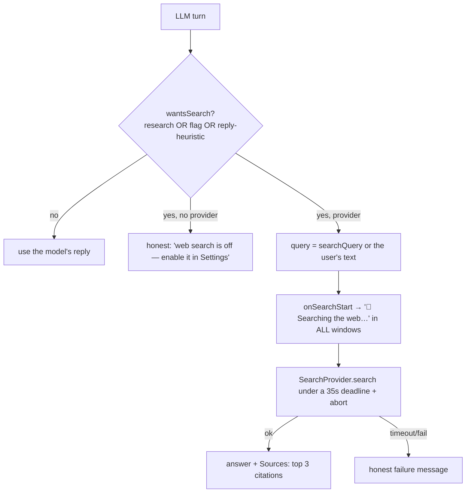

# Web Search (Tool Layer)

> **Home:** [docs/README.md](./README.md) · **Related:** [AI_INTEGRATIONS](./AI_INTEGRATIONS.md)

Web search is Yogi's one wired "tool" — a capability the conversation can call to fetch live facts (a phone number, today's weather, prices, "top X", a college's contact) and answer with **cited sources**. It is a **separate seam** from the LLM (`SearchProvider`), so a different search backend (Brave/Tavily) could drop in without touching the chat path.

Files: `core/search/search-provider.ts` (seam), `electron/providers/openai-search-provider.ts` (backend), the `wantsSearch` logic in `electron/conversation/conversation-engine.ts`.

## 1. When a search fires

A reply-only or `research` turn triggers a search when **any** of these hold (`conversation-engine.ts`):

1. **`intent === 'research'`** — always. The system prompt classifies live lookups as `research`, and the engine forces a search for them (routing `research` into the answer branch was the fix for the "stuck on *Let me look that up…*" bug).
2. **`turn.needsWebSearch === true`** — the model set the structured flag.
3. **`LOOKUP_REPLY_RE` matches the reply** — a reply-text heuristic ("let me look that up", "I'll check", "searching the web") backstops the flag, because gpt-4o-mini is unreliable about setting `needsWebSearch`.

## 2. The provider

`OpenAiSearchProvider` uses `gpt-4o-mini-search-preview` and parses `url_citation` annotations into `SearchCitation[]`. It has its own 30s timeout and honors the abort signal; the engine adds a 35s turn deadline (`SEARCH_DEADLINE_MS`). Enabled only when `web_search_enabled` + AI enabled + key + AI consent (`makeSearchProvider`).

## 3. Answer shape

- **Spoken** (`onSpeak`): the answer text only — URLs read badly aloud.
- **Shown** (`chat:done`): the answer + a compact `Sources:` list (top 3, "• title — url").
- The search status and sources appear in **both** the launcher and the main chat (session-scoped `chat:searching`).

## 4. Honest degradation

- **No provider** (search off / not consented): "I can look that up, but web search is turned off right now — enable Web Search in Settings and ask me again." (never left stranded on "Let me look that up…").
- **Timeout**: "Sorry, that search took too long — please try again."
- **Failure**: "I searched but couldn't find that just now — you could try their official website, or ask me again."
- A user cancel throws to the outer catch (no broadcast).

## 5. The reliability-guard interaction

The engine's "reminder claim" guard (which rewrites a fabricated "I set a reminder" into an honest failure) is **gated on `!wantsSearch`** — if a search ran, the reply is the *answer* (e.g. to "best reminder apps"), not a reminder claim, so matching "reminder is set" in that answer would wrongly clobber it. Regression-tested.

## 6. Also used by reminder-execution

The same `SearchProvider` seam powers **AI-task reminders**: a reminder like "remind me tomorrow to tell me NIT Hamirpur's contact" runs the search *when it fires* and speaks the answer. See [REMINDER_SYSTEM §9](./REMINDER_SYSTEM.md) and `electron/reminders/reminder-executor.ts`.

## Status & history

✅ Working and reliability-hardened. The long saga (documented in the changelog) was about **triggering**, not the provider: `research`-intent turns took the wrong branch and never searched, and gpt-4o-mini inconsistently set the flag. Both are fixed (force-search on `research` + the reply-text heuristic). The provider itself was never broken.

## Planned

- A **second tool** (Weather via Open-Meteo, or Calendar) behind the same seam, to prove the capability layer is generic. Each new tool should pair a heuristic backstop with logging, exactly like search.
- A non-OpenAI search backend (Brave/Tavily) is a drop-in for `SearchProvider`.
